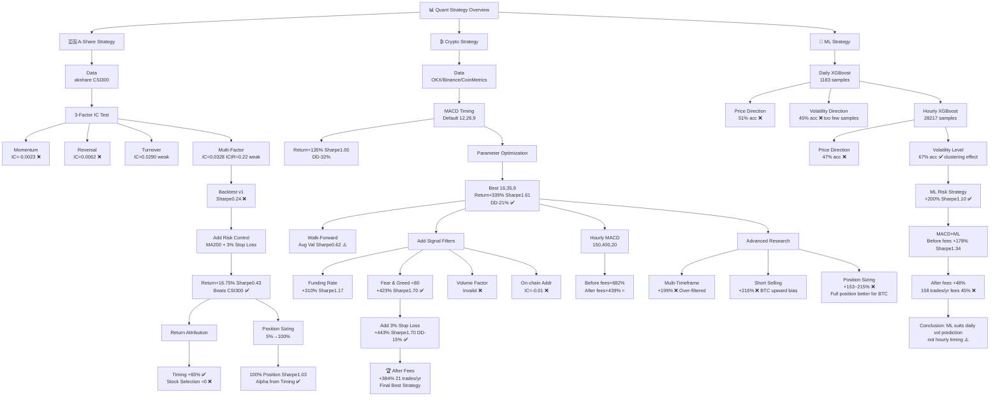

# 📊 QuantResearch

> A systematic quantitative strategy research project covering A-share factor mining, crypto timing strategies, and machine learning signals. Continuously updated.

🌐 [中文版](./README_CN.md)

---

## 🏆 Current Best Strategy（BTC/USDT Daily）

**Strategy: MACD(16,35,9) + Fear & Greed Filter(<80) + 3% Stop Loss**

| Metric | Value |
|--------|-------|
| 📅 Period | 2023.01 — 2026.03 |
| 💰 Cumulative Return (after fees) | **+384%** |
| 📈 Benchmark (Buy & Hold) | +127% |
| ⚡ Sharpe Ratio | **1.70** |
| 🛡️ Max Drawdown | **-16%** |
| 🔁 Avg Trades / Year | 21 |

---

## 🗺️ Strategy Evolution Map



---

## 📁 Project Structure

```
QuantResearch/
├── 01_data/                    # 🔧 Data Engineering
│   └── 01_data_cleaning.ipynb  # Data acquisition, adjustment, quality check
├── 02_factors/                 # 🔬 Factor Research
│   ├── 02_factor_ictest.ipynb  # Cross-sectional IC testing
│   └── 04_ml_factor.ipynb      # Machine learning factors
├── 03_backtest/                # 📈 Strategy Backtesting
│   ├── 03_backtest.ipynb       # Backtest framework, risk control, attribution
│   └── 03_roe_factor.ipynb     # Fundamental factor research
└── 04_crypto/                  # ₿ Crypto Strategies
    ├── 01_crypto_data.ipynb    # Multi-exchange data ingestion
    └── 02_live_trading.ipynb   # Live execution framework
```

---

## 🇨🇳 Research Track 1: A-Share Factor Research

### Data Engineering

- Source: akshare, CSI300 constituents, forward-adjusted daily OHLCV
- Cleaning: dividend/split adjustment, suspension filling, MAD winsorization, survivorship-bias-free universe

### Factor IC Test Results

| Factor | IC Mean | ICIR | IC>0 Rate | Verdict |
|--------|---------|------|-----------|---------|
| Momentum (20D) | -0.0023 | -0.011 | 50.6% | ❌ Invalid |
| Reversal (5D) | 0.0062 | 0.032 | 49.6% | ❌ Invalid |
| Turnover Rate | 0.0290 | 0.109 | 55.1% | ⚠️ Weak |
| 3-Factor Composite | 0.0328 | 0.224 | 58.3% | ⚠️ Weak |

> Passing bar: IC Mean > 0.05, ICIR > 0.5, IC>0 > 55%

### Backtest & Return Attribution

| Strategy | Cumulative Return | Sharpe | Max DD |
|----------|------------------|--------|--------|
| 3-Factor Composite (base) | +8.56% | 0.24 | -22.73% |
| + MA200 Timing + Stop Loss | +16.75% | 0.43 | -15.06% |
| CSI300 Benchmark | +10.17% | — | — |

**💡 Attribution Findings**
- Pure Timing (MA200, full position): +65%, Sharpe 1.15 ✅
- Pure Stock Selection (3-factor, no risk control): +8.56%, Sharpe 0.24 ❌
- **All alpha originates from the timing module; factor selection contributes zero**

---

## ₿ Research Track 2: Crypto Timing Strategy

### Data Infrastructure

| Data Type | Source | Coverage |
|-----------|--------|---------|
| BTC/USDT Daily | OKX API | 2023.01–now, 1,183 bars |
| BTC/USDT Hourly | OKX API | 2023.01–now, 28,385 bars |
| Funding Rate | Binance API | 2019.09–now, 7,174 records |
| Fear & Greed Index | Alternative.me | 2020.10–now, 2,000 records |
| On-chain Active Addresses | CoinMetrics | 2020.10–now |

### Strategy Iteration

| Strategy Version | Cum. Return | Sharpe | Max DD |
|-----------------|-------------|--------|--------|
| MACD Default (12,26,9) | +135% | 1.00 | -32% |
| MACD Optimized (16,35,9) | +339% | 1.61 | -21% |
| + Funding Rate Filter | +310% | 1.17 | -49% |
| + Fear & Greed Filter (<80) | +423% | 1.70 | -15% |
| + 3% Stop Loss | +443% | 1.70 | -15% |
| **🏆 After Transaction Costs** | **+384%** | **1.70** | **-16%** |

### Walk-Forward Validation

| Fold | Best Params | Train Sharpe | Val Sharpe |
|------|------------|-------------|-----------|
| 1 | (16,35,9) | 2.99 | -0.65 |
| 2 | (16,35,12) | 2.90 | -0.18 |
| 3 | (20,26,12) | 1.73 | 3.22 |
| 4 | (8,21,7) | 0.42 | 0.09 |
| **Average** | — | — | **0.62** |

### Factor Validity Summary

| Factor | Test Result | Included |
|--------|-------------|---------|
| MACD Trend | Sharpe 1.61, core signal | ✅ Yes |
| Fear & Greed | Composite Sharpe 1.70 | ✅ Filter |
| Funding Rate | Standalone Sharpe 1.17 | Candidate |
| Volume Factor | Invalid, over-filters in combo | ❌ No |
| On-chain Addresses | IC=-0.01, ETF-cycle failure | ❌ No |

### Advanced Explorations

| Direction | Result | Root Cause |
|-----------|--------|-----------|
| Multi-timeframe Confluence | +199% ❌ | Holding time drops to 28%, misses rallies |
| Short Selling | +216% ❌ | BTC long-term upward bias |
| Position Sizing | +153–215% ❌ | Strong trend asset; full position dominates |
| Hourly MACD (after fees) | +439% ≈ | 102 trades/yr; fee drag significant |

---

## 🤖 Research Track 3: Machine Learning Signals

### Experiment Results

| Target | Frequency | Samples | Accuracy | Verdict |
|--------|-----------|---------|----------|---------|
| 5D Price Direction | Daily | 1,183 | 51% | ❌ Near-random |
| 10D Price Direction | Daily | 1,183 | 45% | ❌ Below random |
| 24H Price Direction | Hourly | 28,217 | 47% | ❌ Near-random |
| **24H Volatility Level** | **Hourly** | **28,217** | **67%** | **✅ Effective** |

### Strategy Performance

| Strategy | Cum. Return | Sharpe | Note |
|----------|-------------|--------|------|
| ML Risk Prediction | +200% | 1.10 | Beats buy & hold ✅ |
| MACD + ML (pre-fee) | +178% | 1.34 | — |
| MACD + ML (post-fee) | +48% | — | 45% eaten by fees ❌ |

**💡 Conclusion: ML volatility prediction adds value at daily frequency; hourly frequency is not deployable due to transaction costs**

---

## 📌 Key Research Findings

| # | Finding |
|---|---------|
| 1 | 🎯 **Simple strategies are more robust**: MACD + sentiment filter + stop loss beats all complex attempts |
| 2 | 🔍 **Return attribution is essential**: 100% of A-share alpha comes from timing; stock selection contributes zero |
| 3 | 💸 **Transaction costs set the minimum viable frequency**: 21 trades/yr (daily) is negligible; 100+/yr (hourly) eliminates alpha |
| 4 | ⚠️ **Walk-Forward is mandatory against overfitting**: In-sample Sharpe peaks at 2.99; out-of-sample averages 0.62 |
| 5 | 📐 **Asset characteristics determine strategy shape**: BTC suits full-position trend following; A-shares suit cross-sectional factor selection |

---

## 🛠️ Tech Stack

```
Python 3.10+
pandas / numpy          Time series & data processing
akshare                 A-share market data
ccxt                    Multi-exchange crypto API
requests                On-chain & sentiment data APIs
xgboost / scikit-learn  ML modeling & evaluation
matplotlib              Visualization
```

---

## 🗂️ Data Files

| File | Description |
|------|-------------|
| `03_backtest/close_data.csv` | CSI300 daily close prices |
| `03_backtest/volume_data.csv` | CSI300 turnover rates |
| `04_crypto/btc_daily.csv` | BTC/USDT daily OHLCV |
| `04_crypto/btc_1h.csv` | BTC/USDT hourly OHLCV |
| `04_crypto/btc_funding_full.csv` | BTC perpetual funding rates |
| `04_crypto/btc_fng.csv` | Crypto Fear & Greed Index |
| `04_crypto/crypto_close.csv` | Top 10 crypto close prices |

---

## 🔭 Roadmap

- [ ] Multi-coin cross-sectional factor selection (20+ coins)
- [ ] Dynamic position sizing via daily volatility prediction
- [ ] Live execution module (OKX API)
- [ ] A-share fundamental factors (ROE/TTM): pending stable data source
- [ ] Cross-asset correlation factor research

---

*🔄 Research in progress — Last updated: 2026.03*
