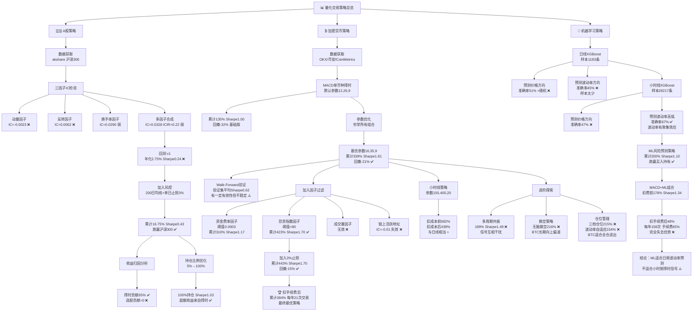

# 📊 QuantResearch

> 系统性量化策略研究项目，覆盖 A 股因子挖掘、加密货币择时策略与机器学习信号三条研究主线。持续迭代中。

---

## 🏆 当前最优策略（BTC/USDT 日线）

**策略：MACD(16,35,9) + 恐贪指数过滤(<80) + 3% 止损**

| 指标 | 数值 |
|------|------|
| 📅 区间 | 2023.01 — 2026.03 |
| 💰 累计收益（扣手续费） | **+384%** |
| 📈 基准（买入持有） | +127% |
| ⚡ Sharpe Ratio | **1.70** |
| 🛡️ 最大回撤 | **-16%** |
| 🔁 年均交易次数 | 21次 |

---

## 🗺️ 策略演进全图



---

## 📁 项目结构

```
QuantResearch/
├── 01_data/                    # 🔧 数据工程
│   └── 01_data_cleaning.ipynb  # 数据获取、复权处理、质量检验
├── 02_factors/                 # 🔬 因子研究
│   ├── 02_factor_ictest.ipynb  # 截面因子 IC 检验体系
│   └── 04_ml_factor.ipynb      # 机器学习因子
├── 03_backtest/                # 📈 策略回测
│   ├── 03_backtest.ipynb       # 回测框架、风控模块、收益归因
│   └── 03_roe_factor.ipynb     # 基本面因子研究
└── 04_crypto/                  # ₿ 加密货币策略
    ├── 01_crypto_data.ipynb    # 多交易所数据接入
    └── 02_live_trading.ipynb   # 实盘执行框架
```

---

## 🇨🇳 研究主线一：A 股因子研究

### 数据工程

- 数据源：akshare，沪深300成分股，前复权日线
- 数据清洗：复权处理（送股/派息/配股）、停牌缺失值填充、异常值 MAD 截断、全样本避免幸存者偏差

### 因子有效性检验

| 因子 | IC 均值 | ICIR | IC>0 比例 | 结论 |
|------|---------|------|-----------|------|
| 动量（20日） | -0.0023 | -0.011 | 50.6% | ❌ 无效 |
| 反转（5日） | 0.0062 | 0.032 | 49.6% | ❌ 无效 |
| 换手率 | 0.0290 | 0.109 | 55.1% | ⚠️ 弱有效 |
| 三因子等权合成 | 0.0328 | 0.224 | 58.3% | ⚠️ 弱有效 |

> IC 合格标准：均值 > 0.05，ICIR > 0.5，IC>0 比例 > 55%

### 策略回测与收益归因

| 策略版本 | 累计收益 | Sharpe | 最大回撤 |
|----------|---------|--------|---------|
| 三因子合成基础版 | +8.56% | 0.24 | -22.73% |
| + 200日均线择时 + 止损 | +16.75% | 0.43 | -15.06% |
| 沪深300基准 | +10.17% | — | — |

**💡 收益归因结论**
- 纯择时（200日均线满仓）：累计 +65%，Sharpe 1.15 ✅
- 纯选股（三因子，无风控）：累计 +8.56%，Sharpe 0.24 ❌
- **当前超额收益完全来源于择时模块，因子选股贡献为零**

---

## ₿ 研究主线二：加密货币择时策略

### 数据基础设施

| 数据类型 | 来源 | 覆盖范围 |
|----------|------|---------|
| BTC/USDT 日线 | OKX API | 2023.01 至今，1183条 |
| BTC/USDT 小时线 | OKX API | 2023.01 至今，28385条 |
| 资金费率 | 币安 API | 2019.09 至今，7174条 |
| 恐贪指数 | Alternative.me | 2020.10 至今，2000条 |
| 链上活跃地址 | CoinMetrics | 2020.10 至今 |

### 策略迭代路径

| 策略版本 | 累计收益 | Sharpe | 最大回撤 |
|----------|---------|--------|---------|
| MACD 默认参数 (12,26,9) | +135% | 1.00 | -32% |
| MACD 最优参数 (16,35,9) | +339% | 1.61 | -21% |
| + 资金费率过滤 | +310% | 1.17 | -49% |
| + 恐贪指数过滤(<80) | +423% | 1.70 | -15% |
| + 3% 止损 | +443% | 1.70 | -15% |
| **🏆 扣手续费后（最终）** | **+384%** | **1.70** | **-16%** |

### Walk-Forward 验证

| 段 | 最优参数 | 训练Sharpe | 验证Sharpe |
|----|---------|-----------|-----------|
| 第1段 | (16,35,9) | 2.99 | -0.65 |
| 第2段 | (16,35,12) | 2.90 | -0.18 |
| 第3段 | (20,26,12) | 1.73 | 3.22 |
| 第4段 | (8,21,7) | 0.42 | 0.09 |
| **平均** | — | — | **0.62** |

### 因子有效性汇总

| 因子 | 测试结果 | 纳入策略 |
|------|---------|---------|
| MACD 趋势跟踪 | Sharpe 1.61 | ✅ 核心信号 |
| 恐贪指数 | 组合后 Sharpe 1.70 | ✅ 过滤器 |
| 资金费率 | 单独 Sharpe 1.17 | 备选 |
| 成交量因子 | 无效，叠加过滤过度 | ❌ |
| 链上活跃地址 | IC=-0.01，本轮失效 | ❌ |

### 进阶方向探索

| 方向 | 结果 | 原因 |
|------|------|------|
| 多周期共振 | +199% ❌ | 持仓时间降至28%，错过主升浪 |
| 做空策略 | +216% ❌ | BTC 长期向上偏差 |
| 仓位管理 | +153~215% ❌ | BTC 强趋势，全仓进出更优 |
| 小时线（扣费后） | +439% ≈ | 每年102次，手续费侵蚀显著 |

---

## 🤖 研究主线三：机器学习信号

### 实验结果

| 预测目标 | 频率 | 样本量 | 准确率 | 结论 |
|----------|------|--------|--------|------|
| 未来5天价格涨跌 | 日线 | 1,183 | 51% | ❌ 接近随机 |
| 未来10天价格涨跌 | 日线 | 1,183 | 45% | ❌ 低于随机 |
| 未来24小时价格涨跌 | 小时线 | 28,217 | 47% | ❌ 接近随机 |
| **未来24小时波动率高低** | **小时线** | **28,217** | **67%** | **✅ 有效** |

### 策略表现

| 策略 | 累计收益 | Sharpe | 备注 |
|------|---------|--------|------|
| ML 风险预测 | +200% | 1.10 | 跑赢买入持有 ✅ |
| MACD + ML（扣费前） | +178% | 1.34 | — |
| MACD + ML（扣费后） | +48% | — | 手续费侵蚀45% ❌ |

**💡 结论：ML 波动率预测在日频有应用价值，小时频因交易成本问题暂不适合实盘部署**

---

## 📌 核心研究结论

| # | 结论 |
|---|------|
| 1 | 🎯 **简单策略鲁棒性更强**：MACD+情绪过滤+止损优于所有复杂化尝试 |
| 2 | 🔍 **收益归因是必要环节**：A股超额收益100%来自择时，选股贡献为零 |
| 3 | 💸 **手续费决定策略频率下限**：日线21次/年可忽略；小时线100次+/年直接消灭超额收益 |
| 4 | ⚠️ **Walk-Forward 是防过拟合门槛**：样本内Sharpe最高2.99，验证集平均0.62 |
| 5 | 📐 **资产特性决定策略形态**：BTC强趋势适合全仓跟踪；A股适合截面因子选股 |

---

## 🛠️ 技术栈

```
Python 3.10+
pandas / numpy          数据处理与时间序列
akshare                 A股行情与财务数据
ccxt                    加密货币多交易所API接入
requests                链上数据与情绪数据API
xgboost / scikit-learn  机器学习建模与评估
matplotlib              数据可视化
```

---

## 🗂️ 数据文件

| 文件 | 说明 |
|------|------|
| `03_backtest/close_data.csv` | 沪深300成分股日线收盘价 |
| `03_backtest/volume_data.csv` | 沪深300成分股换手率 |
| `04_crypto/btc_daily.csv` | BTC/USDT 日线 OHLCV |
| `04_crypto/btc_1h.csv` | BTC/USDT 小时线 OHLCV |
| `04_crypto/btc_funding_full.csv` | BTC 永续合约资金费率 |
| `04_crypto/btc_fng.csv` | 加密货币恐贪指数 |
| `04_crypto/crypto_close.csv` | 10个主流币种收盘价 |

---

## 🔭 后续研究方向

- [ ] 多币种截面因子选币（扩展至20+币种）
- [ ] 基于日频波动率预测的仓位动态调整
- [ ] 实盘执行模块对接（OKX API）
- [ ] A股基本面因子（ROE/TTM）：待稳定数据源
- [ ] 跨资产相关性因子研究

---

*🔄 Research in progress — Last updated: 2026.03*
